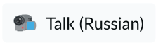

<div align="center">
  
  
  
  ## Accessibility testing is not scary
  
  _Test on the same page with your users!_
  
  <!--<a>
    </a>-->
  <a href="https://illright.github.io/a11y-testing-is-not-scary/">
    </a>
  <a href="./README.ru.md">
    </a>
</div>

<br />

A talk on the importance of HTML roles for accessibility and website navigation from a tester's perspective and a practical showcase of [the Testing Library](https://testing-library.com/) for accessibility testing with Cypress.

This talk was given at [Merge 2022](https://mergeconf.ru/) in Innopolis, Russia.

## Key points

* A significant obstacle in automated testing is how to use the website programmatically
* There are two common approaches to locating elements on the page:
  * Using CSS selectors
  * Using test IDs
* The aforementioned approaches don't represent the way real users use the website  
* HTML roles are a way of communicating important regions and interactive elements to the browser 
* Testing Library helps to use roles to build resilient tests, checking accessibility along the way

## Example app

The app is a Next.js frontend for the [Real World App](https://realworld.io/) project. The following modifications have been made ([compare](https://github.com/illright/next-realworld-example-app/compare/main...a11y)):

* The article list has been turned into a `feed` ([`ccda521`](https://github.com/illright/next-realworld-example-app/commit/ccda52106e7cec9208b1fa4d73dee88ee1b813b2))
* Each article has been turned into an `article` and given an accessible name ([`e197baf`](https://github.com/illright/next-realworld-example-app/commit/e197baf8c7a66a62821d57c7a41de3980b02ee6d))
* The sidebar with tags has been turned into a `complementary` and given an accessible name ([`4b808c6`](https://github.com/illright/next-realworld-example-app/commit/4b808c670e96bd95d3d5ffc3a7f7c94a27b13612))
* The tab bar has been turned into a `tablist` ([`d825145`](https://github.com/illright/next-realworld-example-app/commit/d825145b838cac08c5ca65723f71ca757bc000b6))
* Integration tests have been written in Cypress ([`6dfe4bc`](https://github.com/illright/next-realworld-example-app/commit/6dfe4bc1b85893be9859aec475c92b516201e75a))
* Accessbile labels have been given to the form fields in the sign-up form ([`3d2dea2`](https://github.com/illright/next-realworld-example-app/commit/3d2dea2c918972df085bc8840099bb18ea452fdb))

## Present locally

The slides are powered by [Slidev](https://sli.dev). Start them with the `dev` script inside the `slides/` directory:

```bash
cd slides
pnpm i
pnpm dev
```

## License

The Merge conference logo is **copyrighted**, it is distributed with permission from copyright holders.

The emojis are a part of [EmojiOne](https://www.joypixels.com/), licensed under **CC-BY 4.0**.

The slides and the example app are licensed under **ISC**. [Click here](https://choosealicense.com/licenses/isc/) to learn more about the license.

